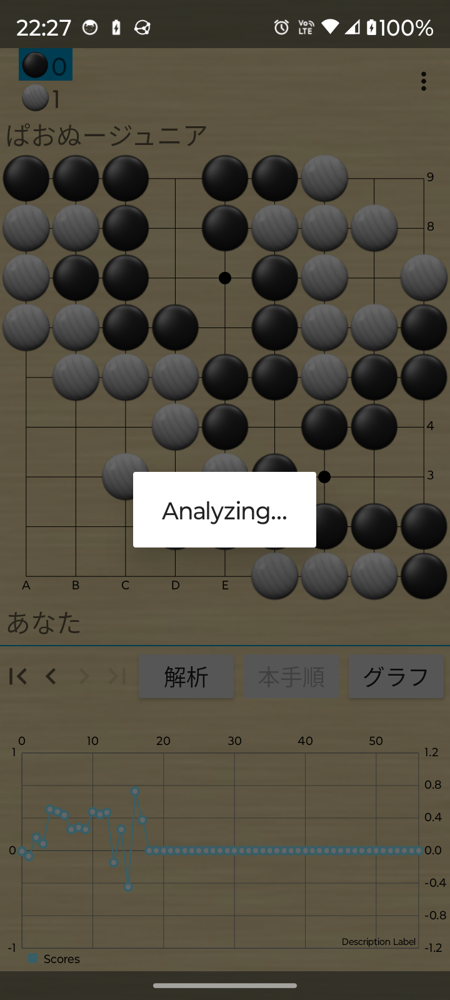

# PaooGo

Android igo app for primer, forked from [gobandroid](https://github.com/ligi/gobandroid).

Download: [GooglePlay: PaooGo](https://play.google.com/store/apps/details?id=io.github.karino2.paoogo)

## Screenshot

## Used engine

- [karino2/GnuGo2Fork](https://github.com/karino2/GnuGo2Fork)
- [karino2/Ray android_fork](https://github.com/karino2/Ray/tree/android_fork)
- [karino2/LibertyFork](https://github.com/karino2/LibertyFork)
- [karino2/KataGo: android_fork](https://github.com/karino2/KataGo)
- [karino2/AmigoGtpFork](https://github.com/karino2/AmigoGtpFork)
- [karino2/gnugo_fork: android_fork](https://github.com/karino2/gnugo_fork)
